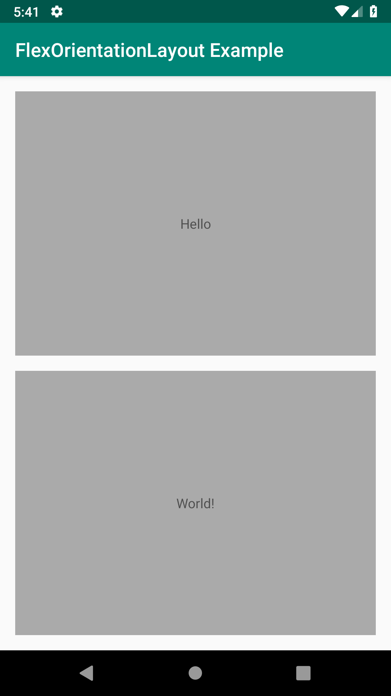
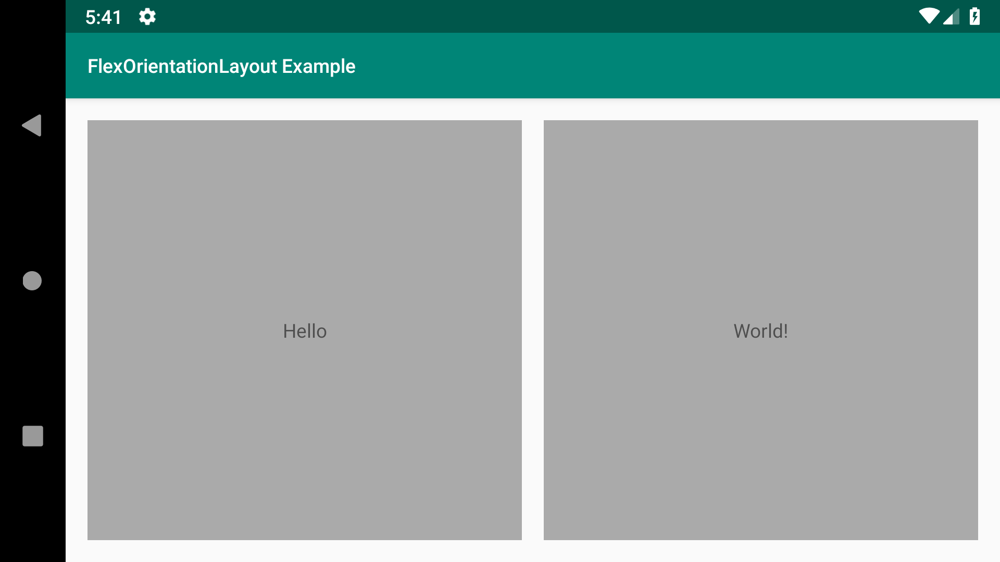

# Intro
A flexible LinearLayout that automatically updates its own orientation based on the device orientation.

 

# Setup
Add it to your build.gradle with:

```gradle
allprojects {
    repositories {
        maven { url "https://jitpack.io" }
    }
}
```
and:

```gradle
dependencies {
    implementation 'com.github.FancyPixel:flexorientationlayout:0.1.0'
}
```


# Usages
Use the FlexOrientationLayout as a standard LinearLayout.
```xml
<it.fancypixel.flexorientationlayout.FlexOrientationLayout
      android:layout_width="match_parent"
      android:layout_height="match_parent"
      app:reverse_layout="true">
      <TextView
          android:layout_width="match_parent"
          android:layout_weight="1"
          android:layout_height="match_parent"
          android:gravity="center"
          android:text="Hello"/>
      <TextView
          android:layout_width="match_parent"
          android:layout_weight="1"
          android:layout_height="match_parent"
          android:gravity="center"
          android:text="World!"/>
</it.fancypixel.flexorientationlayout.FlexOrientationLayout>

```


#### Customization Options

By default the FlexOrientationLayout will update its own orientation based on the device orientation.

| Device                        | FlexOrientationLayout     |
| ----------------------------- | ------------------------- |
| `Configuration.PORTRAIT`      | `Orientation.VERTICAL`    |
| `Configuration.LANDSCAPE`     | `Orientation.HORIZONTAL`  |

You could reverse this behavior by setting the attibute `reversed_orientation` to `true`.

```xml
<it.fancypixel.flexorientationlayout.FlexOrientationLayout
      android:layout_width="match_parent"
      android:layout_height="match_parent"
      android:id="@+id/flex_orientation_layout"
      app:reversed_orientation="true" />
```

```java        

flex_orientation_layout.useReversedOrientation(true)


```

# License

    MIT License

    Copyright (c) 2019

    Permission is hereby granted, free of charge, to any person obtaining a copy
    of this software and associated documentation files (the "Software"), to deal
    in the Software without restriction, including without limitation the rights
    to use, copy, modify, merge, publish, distribute, sublicense, and/or sell
    copies of the Software, and to permit persons to whom the Software is
    furnished to do so, subject to the following conditions:

    The above copyright notice and this permission notice shall be included in all
    copies or substantial portions of the Software.

    THE SOFTWARE IS PROVIDED "AS IS", WITHOUT WARRANTY OF ANY KIND, EXPRESS OR
    IMPLIED, INCLUDING BUT NOT LIMITED TO THE WARRANTIES OF MERCHANTABILITY,
    FITNESS FOR A PARTICULAR PURPOSE AND NONINFRINGEMENT. IN NO EVENT SHALL THE
    AUTHORS OR COPYRIGHT HOLDERS BE LIABLE FOR ANY CLAIM, DAMAGES OR OTHER
    LIABILITY, WHETHER IN AN ACTION OF CONTRACT, TORT OR OTHERWISE, ARISING FROM,
    OUT OF OR IN CONNECTION WITH THE SOFTWARE OR THE USE OR OTHER DEALINGS IN THE
    SOFTWARE.
